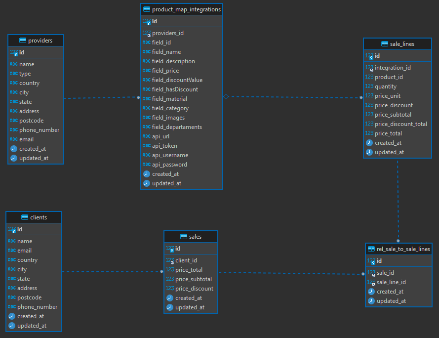
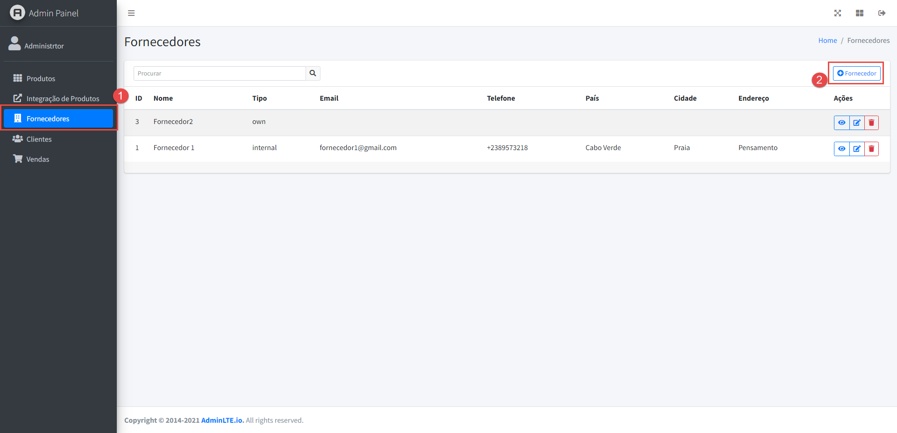
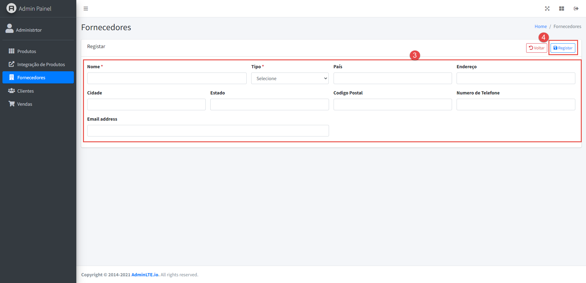
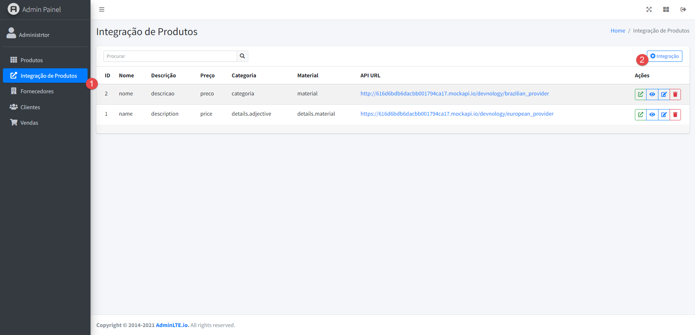
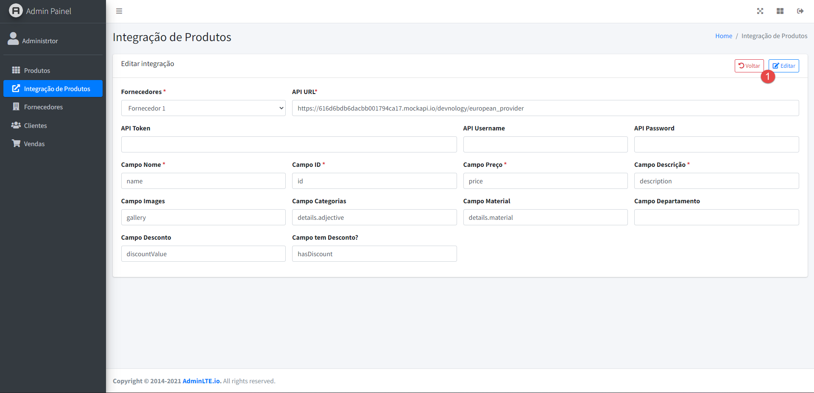
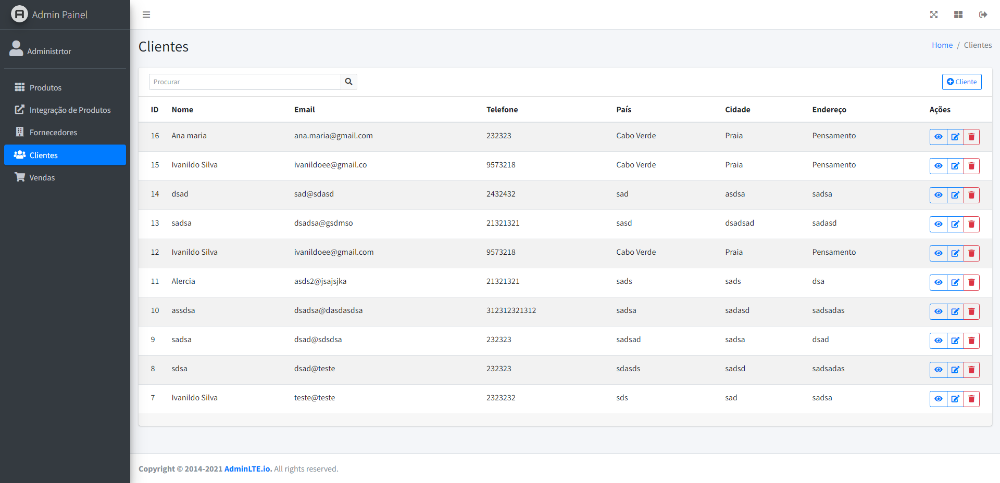
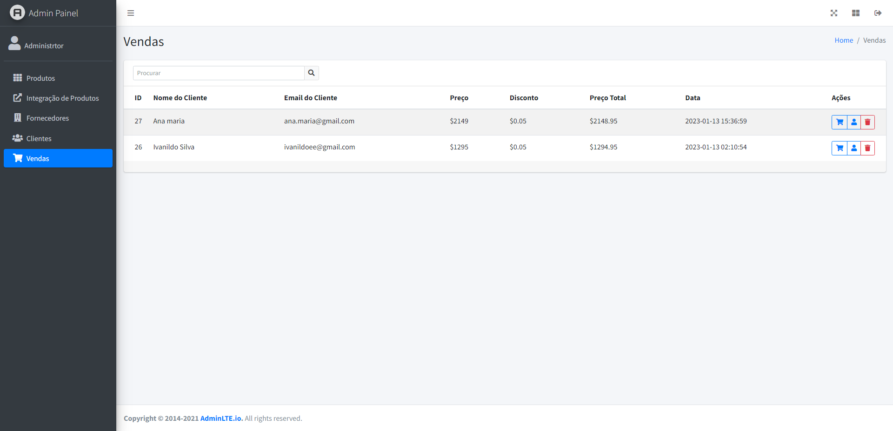
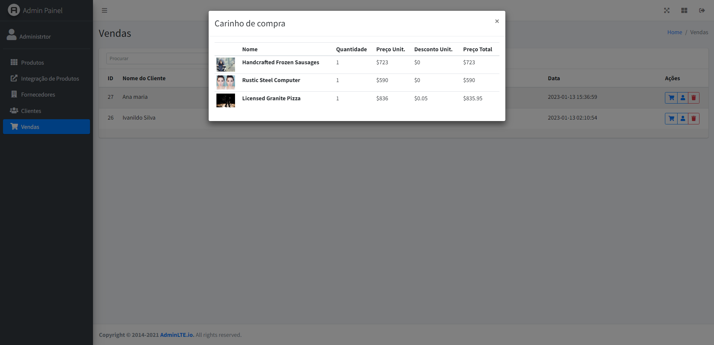

### Logica do Backend

Dada o desafio elaborou-se um conjunto de regras para o backend
1. A loja deve suportar diversos fornecedores
2. Cada fornecedor pode disponibilizar diversos API de Produtos
3. Aplicação deve mapear cada API para um padrão de Pruduto
4. Deve-se registar um cliente
5. Deve-se registar uma venda e adicionar todos os produtos

Abaixo segue-se o modelo de dados implementado



### Processos a serem executados
- [x] Criar modelo de dados
- [x] Crud do Fornecedor
- [x] Mapeamento de API para cada Fornecedor
- [x] Crud do Cliente
- [x] Registo de Venda


### Instalação do projeto

Intalar dependencia do projeto
```
composer install
```
Adicionar informação da database em .env
```
DB_CONNECTION=mysql
DB_HOST=127.0.0.1
DB_PORT=3306
DB_DATABASE=app
DB_USERNAME=username
DB_PASSWORD=password
```
Fazer a migração da database
```
php artisan migrate
```
Iniciar o servidor
```
php artisan serve
```

Abrir o link [http://localhost:8000](http://localhost:8000)

### Guia do uso da aplicação
A parte da gestão da loja foi feito com o Laravel

1. Registar um fornecedor



2. Mapeamento de Integração. Deves indicar o nome para cada campo de API



3. Após isso é capaz de consultar os produtos


4. Quando um cliente efetua uma compra é registrado o seu dados e o detalhe da venda




### Proximos passos
- [ ] Login na aplicação
- [ ] Paginação no Produto


